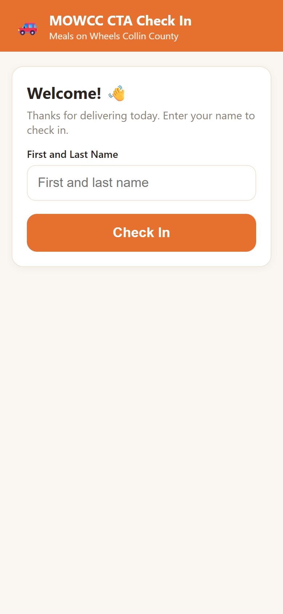
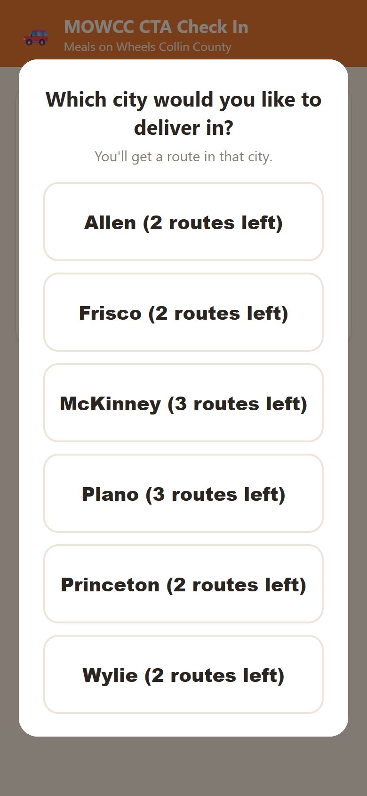
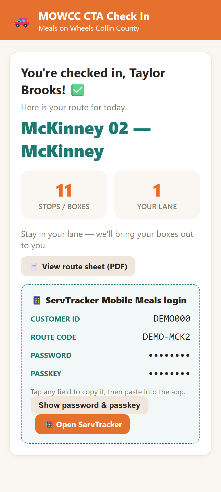
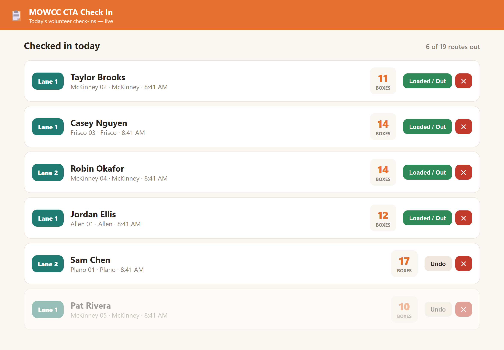

# Case Study: Volunteer Check-In System for Meals on Wheels Collin County

**Role:** Designed, built, deployed, and documented the system
**Stack:** Node.js, Express, SQLite, HTML/CSS/JavaScript, Server-Sent Events, Excel (exceljs)
**Status:** In production, used on every delivery day

> This is a case study only. The source code and all operational data belong to
> Meals on Wheels Collin County and are not published. Screenshots use
> made-up sample data.

---

## The problem
Meals on Wheels Collin County delivers meals to older and disabled neighbors
across the county. On delivery days, dozens of volunteers arrive at the loading
area and each one needs to be matched to a delivery route. They also need that
route's login for the delivery app, and their meal boxes have to be brought to
the right loading lane.

That handoff used to be done by hand. Staff had to track which routes were
still open, read logins aloud, and figure out who was in which lane, all while
cars lined up.

## What I built
A **web app volunteers use from their own phones**, with nothing to install:

1. **Scan a QR code** posted at the loading area and type your name.
2. **Pick your lane**, and the city you'd like to deliver in if needed.
3. **Get a route assigned instantly.** Your regular route if it's open,
   otherwise the next open route based on the rules staff choose.
4. **See everything you need** on your phone: route name, number of stops,
   your lane, a link to the printed route sheet, and your delivery-app login
   with tap-to-copy buttons.

At the same moment, a **live dashboard on staff iPads** pops up the
volunteer's name, route, box count, and lane with a chime. Loaders know exactly
where to take the boxes. Staff can mark drivers as loaded and out, change a
lane, or undo a check-in, which frees that route for the next volunteer.

## Key features
- **Three route-assignment modes** staff can switch between: priority order,
  random, or by city. A volunteer's preferred route always comes first.
- **Extra routes when there's capacity.** Volunteers can take a second route
  in the same city, but only while enough open routes remain for everyone
  still expected that day.
- **Admin panel** for managing 90+ routes across about 12 cities, volunteers,
  lanes, and settings.
- **Excel sync**, so staff can bulk-edit routes and volunteers in a spreadsheet
  they already know, then import them back. Missing rows are deactivated, never
  deleted.
- **History and reporting**: browse any past day and export all check-in
  history to Excel.
- **Written SOP and operator guide** so staff can run the system without me.

## Design decisions
| Decision | Why |
|---|---|
| Web app, not a native app | Volunteers (many of them retirees) use their own phones. Nothing to download means no setup barrier. |
| Simple, low-cost stack (Node + SQLite) | The nonprofit has no IT department. It runs on an office PC and backs up by copying one file. |
| Secure public access through a tunnel instead of paid cloud hosting | Volunteers load outdoors on cell data, so the app has to be reachable from the internet. This kept hosting cost at $0. |
| Secret-key QR code, plus a staff PIN on the dashboard and admin pages | The app has to be on the internet, but only people standing at the loading area should be able to check in or see route logins. |
| Check-ins are never hard-deleted | Staff can undo mistakes, and history stays complete for reporting. |

## What I learned
- Designing for **real users under time pressure**, like a volunteer in a car
  line, means one decision per screen and very large buttons.
- **Adoption matters more than sophistication.** The Excel sync and the
  written SOP did as much for adoption as any technical feature.
- Securing an app that has to be public, with protection matched to the real
  risk.

## Screenshots
_All screenshots use made-up sample data._

| Scan & enter name | Pick a city | Route assigned |
|---|---|---|
|  |  |  |

**Live staff dashboard**

**Portfolio page:** https://hassamk28.github.io/hassamk/mowcc-checkin.html
